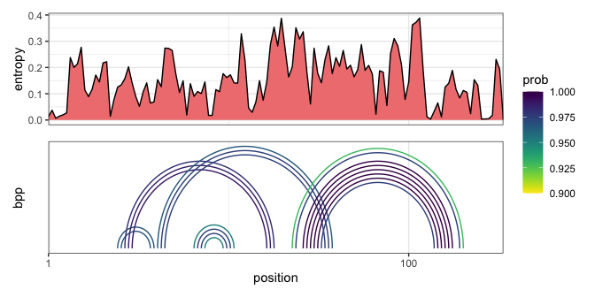

<!-- README.md is generated from README.Rmd. Please edit that file -->

# rnafolding <!--  -->

<!-- badges: start -->

[](https://cran.r-project.org/package=rnafolding)
[](https://www.tidyverse.org/lifecycle/#maturing)
<!-- [](https://github.com/ruthkr/rnafolding/actions) -->
<!-- [](https://codecov.io/gh/ruthkr/rnafolding?branch=master) -->
<!-- [](https://ruthkr.github.io/rnafolding/) -->
<!-- badges: end -->

**rnafolding** is a package to…

## Installation

You can install the development version from
[GitHub](https://github.com/) with:

``` r
# install.packages("devtools")
devtools::install_github("ruthkr/rnafolding")
```

<!-- ## Documentation -->

<!-- To use `rnafolding`, you can read the documentation on the following topics: -->

<!-- 1. [Getting started](https://ruthkr.github.io/rnafolding/articles/overview.html) -->

## Quick start

This is a basic example which shows you how to run windowed folding from
a FASTA file:

``` r
# Load the package
library(rnafolding)

# Define the FASTA path from the sample 5S rRNA sequence
seq_5S <- system.file("extdata", "5S.fasta", package = "rnafolding")

# Fold 5S with Sliding Windows
windows_5S <- rnafolding::fold(
  filename = seq_5S,
  winsize = 50,
  stepsize = 5
)
```

After getting the windowed folding results, you can plot the structure
map as follows:

``` r
plot_structure_map(
  windows_5S,
  plot_list = c("entropy", "bpp")
)
```



<!-- More examples with different input formats are available on functions documentations and vignettes, please refer to the [documentation](https://ruthkr.github.io/rnafolding). -->
